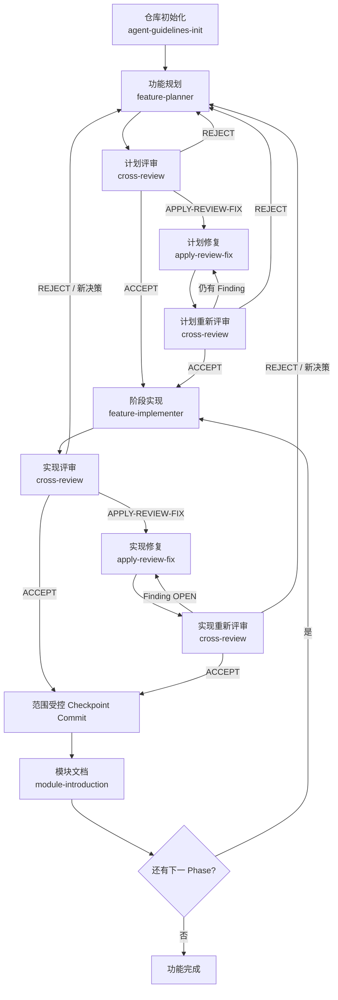
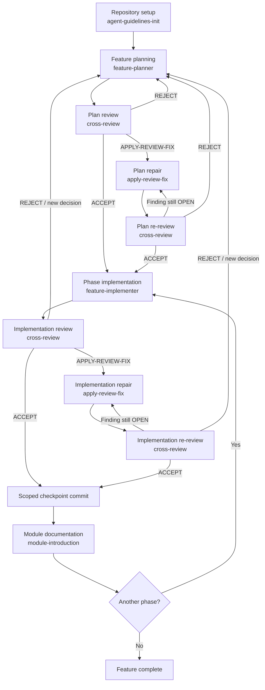

# Personal Coding Skills

[](https://github.com/chuansao258-888/personal-coding-skills/actions/workflows/validate-skills.yml)

Reusable Codex skills for evidence-based planning, implementation, independent
review, bounded repair, repository guidance, and module documentation.

可复用的 Codex 技能集合，用于证据驱动的功能规划、实现、独立评审、
范围受控的修复、仓库规范初始化和模块技术文档。

- [中文说明](#中文说明)
- [English Guide](#english-guide)
- [Published skills](skills-manifest.json)

---

## 中文说明

### 1. 项目定位

本仓库发布六个彼此协作的个人 Codex 技能。它们不是六个互不相关的
prompt，而是一套带有明确入口、证据、状态和交接契约的工程循环：

1. 为仓库建立可持续的 Agent 规范；
2. 把模糊需求转化为可执行、可评审的计划；
3. 在编码前独立评审计划；
4. 按 Finding ID 修复评审发现并重新评审；
5. 只实现已经接受的垂直切片；
6. 独立验收实现，必要时再次进入修复循环；
7. 在实现接受后生成完整模块文档。

仓库级代码质量以英文
[`ENGINEERING_STANDARDS.md`](ENGINEERING_STANDARDS.md) 为 canonical source，
覆盖可读控制流、低嵌套、职责内聚、命名、有效注释、显式逻辑、简单性、
错误处理、测试和变更卫生。`agent-guidelines-init` 发布同一规则体系的
可复用[英文模板](skills/agent-guidelines-init/assets/ENGINEERING_STANDARDS.template.md)。

仓库中的 [`skills-manifest.json`](skills-manifest.json) 是公开技能白名单。
只有清单中的六个目录属于本仓库的发布范围；Codex 自带的 `.system`
技能、运行时缓存和其他个人技能不得被顺带复制进来。

### 2. 技能总览

| Skill | 中文职责 | 主要产物 | 典型下一步 |
|---|---|---|---|
| [`agent-guidelines-init`](skills/agent-guidelines-init/SKILL.md) | 初始化 Git、生成/合并英文工程规范、审计 AI 编码忽略规则并建立 `AGENTS.md` | `ENGINEERING_STANDARDS.md`、仓库工作规范、知识台账、分支与 checkpoint 政策 | `feature-planner` |
| [`feature-planner`](skills/feature-planner/SKILL.md) | 将新需求转化为带稳定 ID、边界和架构契约的实施计划 | Plan、Architecture Contract、Acceptance IDs、Phase boundaries | `cross-review` |
| [`cross-review`](skills/cross-review/SKILL.md) | 独立评审计划或实现，并生成防漂移 Finding Contract | `ACCEPT`、`APPLY-REVIEW-FIX` 或 `REJECT`；Finding IDs | `apply-review-fix` 或 `feature-implementer` |
| [`apply-review-fix`](skills/apply-review-fix/SKILL.md) | 在 Finding 允许边界内完成最小修复，提供关闭证据但不自我关闭 | `READY_FOR_REVIEW`、验证与 cleanup 证据 | `cross-review` |
| [`feature-implementer`](skills/feature-implementer/SKILL.md) | 只实现已接受阶段，完成测试、清理和架构符合性证据 | `IMPLEMENTED_PENDING_REVIEW`、测试、实现记录 | `cross-review` |
| [`module-introduction`](skills/module-introduction/SKILL.md) | 基于代码证据编写完整中文模块介绍与可追问面试答案，解释架构、选型、实现、取舍和演进 | 模块 README/架构说明/面试答案、Mermaid 或必要图片 | 文档评审或交付 |

### 3. 每个技能的详细说明

#### 3.1 `agent-guidelines-init`

**什么时候使用**

- 新仓库尚未初始化 Git；
- 缺少仓库级 `AGENTS.md`；
- 缺少包含可读性、低嵌套、命名、注释、逻辑和测试规则的 canonical
  `ENGINEERING_STANDARDS.md`；
- 需要统一任务分支、阶段 checkpoint、评审关闭、文档配对或 Git 卫生规则；
- 需要维护未来 Agent 必须读取的“项目知识与陷阱”台账。

**核心动作**

- 先确认真正的 Git 根目录，避免在已有仓库内创建嵌套仓库；
- 没有 canonical standard 时，从英文模板生成项目本地
  `ENGINEERING_STANDARDS.md`；已有规范时只合并缺失规则，不整体覆盖；
- 按实际语言和框架保留适用 profile，并验证稳定 Rule ID 唯一且没有模板占位符；
- 公开、团队或 CI 使用的规范默认跟踪；只有明确的个人本地规范才忽略；
- 审计 `.agents/`、`.codex/`、`AGENTS.md`、`CONTEXT.md`、
  等本地 AI 文件的忽略覆盖，并单独验证工程规范的跟踪策略；
- 从真实项目结构、构建命令、测试命令和文档规范生成仓库指南；
- 写入 planning → review → repair → implementation → acceptance 的循环门槛；
- 记录持久且验证过的项目事实，不记录秘密、原始日志或阶段流水账。

**边界与输出**

它是初始化工具，不是每天都要调用的流程技能。它不会自动设置远程仓库、
推送代码或重写 Git 全局配置。输出包括英文工程规范、指向该规范的
仓库级指导和可验证的 gitignore/跟踪状态。

示例：

```text
使用 $agent-guidelines-init 初始化当前仓库。若缺少 canonical standard，
从英文模板生成 ENGINEERING_STANDARDS.md，按技术栈定制 Clean Code 规则，
再更新 AGENTS.md、AI 文件 ignore、计划评审和 checkpoint 规则。
```

#### 3.2 `feature-planner`

**什么时候使用**

- 新功能仍然模糊、跨模块、用户可见或风险较高；
- 涉及 API、数据库、异步任务、模型/provider、安全、隐私或配置；
- 需要参考另一个项目，但不能直接复制其架构假设；
- 编码前需要稳定的验收标准和实施阶段。

**核心动作**

- 执行 Task Branch Gate，并读取仓库规范、术语表、ADR 和现有实现；
- 不替用户猜测产品、架构、provider、数据或安全决策；
- 用稳定的 `AC-001`、`PHASE-01` 等 ID 建立可追踪验收契约；
- 为每个非平凡阶段定义 `Allowed / Not Allowed / Deferred`；
- 写出 Architecture Contract：能力所有者、状态所有者、权威规则、依赖方向、
  事务/并发/幂等边界、失败语义、清理和所需证据；
- 把实现拆成可独立验证的垂直切片，而不是“先做全部后端、再做全部前端”。

**边界与输出**

该技能只负责计划。存在会影响当前阶段的 Open Question、Option、TBD 或
未确认推荐时，计划不能标记为 implementation-ready，也不能进入实现。

示例：

```text
使用 $feature-planner 为“新增多 provider 流式路由”生成实施计划。
请定义稳定 Acceptance IDs、Architecture Contract、每阶段 Allowed /
Not Allowed / Deferred、测试、清理和 checkpoint 门槛，不要开始编码。
```

#### 3.3 `cross-review`

**什么时候使用**

- 计划完成后，需要判断是否可以安全开始编码；
- 一个实现阶段完成后，需要独立验收；
- `apply-review-fix` 返回证据后，需要判断原 Finding 能否关闭。

**两种评审模式**

- **Plan Review**：检查未决决策、范围、生产门槛、稳定验收标准、架构契约、
  分阶段边界和风险；不要求不存在的代码或构建结果。
- **Implementation Review**：检查实现是否满足批准计划、是否存在 bug、漂移、
  隐私/安全问题、无价值复杂度、测试不足或清理遗漏。

每次评审都分开执行：

- **Spec Review**：是否实现了用户真正要求的内容；
- **Standards Review**：是否符合 Architecture、Consistency 和 Simplicity 规则。

**Finding Contract**

每个可执行发现必须保留严重度、分类、证据、Root Cause、Minimal Fix、
Allowed/Not Allowed/Deferred、Acceptance、Validation、Cleanup、Repair
Confidence、Reviewer Checklist 和 Closure Criteria。完整格式位于
[`finding-contract.md`](skills/cross-review/references/finding-contract.md)。

**评审结论**

- `ACCEPT`：当前目标可进入下一阶段；
- `APPLY-REVIEW-FIX`：Finding 已达到可安全修复的证据质量；
- `REJECT`：仍需用户澄清、根因调查或重新规划，不能直接编码。

当实现评审为 `ACCEPT` 且仓库要求阶段提交时，只有该接受评审可以在
Checkpoint Gate 全绿后提交明确的已评审路径；它不能自动 push。

示例：

```text
使用 $cross-review 对 PHASE-02 做 Implementation Review。
分别检查 Spec 与 Standards，复用原 Finding IDs，并只在全部 Closure
Criteria 通过时关闭 Finding。若接受，执行仓库要求的范围受控 checkpoint。
```

#### 3.4 `apply-review-fix`

**什么时候使用**

- `cross-review` 已经给出具体、证据充分、边界清楚的 Finding IDs；
- 评审建议为 `APPLY-REVIEW-FIX`；
- 需要修复计划、文档、代码、测试、配置或 schema，但不能扩张范围。

**核心动作**

- 保留原 Finding ID、Fix Specification、边界、Acceptance 和 Closure Criteria；
- 区分 Plan Fix 与 Implementation Fix；
- 对行为问题尽量先建立失败测试或最小复现；
- 只触碰 `Allowed`，不触碰 `Not Allowed`，不提前实现 `Deferred` 或
  `Future Enhancement`；
- 完成命名的验证、cleanup、陈旧引用搜索和 Architecture/Consistency 证据；
- 将每个 Finding 标记为 `READY_FOR_REVIEW`、`BLOCKED` 或 `INVALID`。

**关键限制**

修复者不能把自己的 Finding 标记为 `CLOSED`，不能通过改写计划来删除需求，
也不能在独立重新评审前提交修复。只有下一轮 `cross-review` 能关闭 Finding。

示例：

```text
使用 $apply-review-fix 修复 F-PLAN-003 和 F-STD-002。
严格遵循原 Allowed/Not Allowed/Deferred，运行指定验证，返回逐 ID 的
READY_FOR_REVIEW 与 Closure Evidence，不要自我关闭 Finding。
```

#### 3.5 `feature-implementer`

**什么时候使用**

- 目标 phase 已有批准计划；
- 最新计划评审为 `ACCEPT`；
- 阻塞 Finding 已被 `cross-review` 标记为 `CLOSED`；
- 所有影响当前阶段的 Open Questions 已解决；
- 前置阶段和必要 checkpoint 已存在。

**核心动作**

- 建立 Phase Execution Contract，并映射 Plan、Phase、Acceptance IDs 和边界；
- 从 Architecture Contract 提取能力/状态所有者、依赖方向和失败语义；
- 以 tracer-bullet 垂直切片实现最小正确变化；
- 优先复用现有模式，避免推测性抽象、透传 wrapper 和无关重构；
- 从 targeted tests 扩展到相关 suite、lint/typecheck/build 和真实 UI 检查；
- 完成 cleanup、陈旧引用搜索和 Architecture Conformance Evidence；
- 更新 implementation document，但只标记 `IMPLEMENTED_PENDING_REVIEW`。

**关键限制**

实现者不能应用尚未经过 repair contract 的评审 Finding，不能自我接受阶段，
也不能在独立实现评审前创建阶段 checkpoint。

示例：

```text
使用 $feature-implementer 实现已接受的 PHASE-02。
按 Acceptance IDs 完成一个垂直切片，遵守 Architecture Contract 和阶段
边界，更新实现记录并标记 IMPLEMENTED_PENDING_REVIEW，不要自我验收。
```

#### 3.6 `module-introduction`

**什么时候使用**

- 已实现模块需要 onboarding、架构 walkthrough、模块 README、技术复盘或面试答案；
- 需要解释架构与技术选型、特殊代码机制、参数设定来源、运行链路和故障语义；
- 需要把分散的代码、测试、配置、迁移和运行证据整理成完整中文文档。

**核心动作**

- 默认使用简体中文，代码标识符和配置键保留原文；
- 先声明模块边界，再建立覆盖台账，确保每个发现项都有正文、排除或
  `未验证` 状态；
- 读取现有计划、实施记录、Finding 和 ADR 作为导航、原始意图和历史线索，
  但把其中每个当前状态声明登记为待核验项；
- 不局限于文档点名的文件，独立搜索当前代码、配置、迁移、测试和调用可达性，
  建立 `一致 / 部分实现 / 已漂移 / 仅计划 / 无法验证 / 文档遗漏` 对照台账；
- 追踪入口 → 编排 → 核心规则 → 基础设施 → 外部依赖 → 输出/持久化；
- 为每个行为参数记录声明位置、来源优先级、默认值依据、绑定/转换、校验、
  最终消费者、行为影响和保密要求；
- 深挖实际方法、分支、状态机、并发原语、事务边界、重试、取消和清理；
- 为核心面试问题同时生成 30 秒、2 分钟和深挖答案，解释“怎么做、为什么、
  为什么不选替代方案”，并覆盖收益、取舍、短板、演进触发条件和证据等级；
- 对“遇到什么困难、怎样解决”使用背景、症状、诊断、根因、行动、验证和
  复盘链路；只认领可证实的个人贡献，不从最终代码虚构开发故事；
- 区分明确记录的历史理由、代码推断和未记录依据，不把继承的技术栈包装成
  模块从零选型，也不虚构 POC、评分或 benchmark；
- 使用适合的 Mermaid；只有图片能显著降低理解成本时才调用 ImageGen，
  并将最终图片落盘到仓库后嵌入。

**边界与输出**

它不把计划或实施记录当成当前实现的绝对权威，不把未运行测试写成通过，
也不凭经验发明代码行为。文档与代码冲突时分别报告历史/期望和当前行为。
输出通常是模块介绍、架构说明、参数来源表、验证证据，以及包含连续追问、
方案对比、困难与解决过程、实现取舍、短板和未来提升的面试答案。

示例：

```text
使用 $module-introduction 为 memory 模块编写完整中文介绍。
覆盖整体架构、技术/算法选择理由、参数来源、关键代码实现、数据与并发语义、
方案取舍、工程难点与解决过程、短板、未来演进和可连续追问的面试答案；
必要时生成并嵌入仓库本地架构图。
```

### 4. Looping Workflow：完整循环用法

#### 4.1 总体流程



#### 4.2 不可跳过的状态规则

| 状态/结论 | 谁可以产生 | 含义 | 下一步 |
|---|---|---|---|
| `OPEN` | `cross-review` | Finding 尚未满足关闭条件 | `apply-review-fix` |
| `READY_FOR_REVIEW` | `apply-review-fix` | 修复者认为证据已准备好，但尚未关闭 | `cross-review` |
| `CLOSED` | `cross-review` | 原 Finding 的全部 Closure Criteria 已通过 | 继续评审或进入实现 |
| `IMPLEMENTED_PENDING_REVIEW` | `feature-implementer` | 编码与验证完成，但尚未独立接受 | `cross-review` |
| `APPLY-REVIEW-FIX` | `cross-review` | Finding 已具备安全、有限的修复契约 | `apply-review-fix` |
| `REJECT` | `cross-review` | 需要澄清、调查或重新规划 | 用户决定或 `feature-planner` |
| `ACCEPT` | `cross-review` | 当前评审目标满足 Spec、Standards 和证据门槛 | 实现、checkpoint 或下一 phase |

#### 4.3 一次完整功能循环

**步骤 0：只执行一次的仓库初始化**

```text
使用 $agent-guidelines-init 审计当前仓库，建立 AGENTS.md、项目知识台账、
任务分支规则、评审关闭门槛和 accepted-phase checkpoint 政策。
```

**步骤 1：规划功能**

```text
使用 $feature-planner 规划 <功能>。先检查当前代码和仓库规范，定义稳定
Acceptance IDs、Architecture Contract、PHASE IDs、Allowed / Not Allowed /
Deferred、测试、清理和 Definition of Done。Open Questions 必须明确解决。
```

**步骤 2：评审计划**

```text
使用 $cross-review 对 <计划路径> 做 Plan Review。分别检查 Spec 和
Standards；若有问题，输出完整 Finding Contract 和 Fix Order。
```

- 如果是 `REJECT`：让用户澄清或回到规划；
- 如果是 `APPLY-REVIEW-FIX`：进入步骤 3；
- 如果是 `ACCEPT`：进入步骤 5。

**步骤 3：修复计划 Finding**

```text
使用 $apply-review-fix 按 Fix Order 修复 <Finding IDs>。
只修改 Finding Allowed 的计划/文档范围，返回 READY_FOR_REVIEW 证据。
```

**步骤 4：重新评审计划**

```text
使用 $cross-review 复核 <Finding IDs>。逐项检查原 Closure Criteria；
未全部通过则保持 OPEN，全部通过才标记 CLOSED 并给出新的 Overall Review。
```

步骤 3 和 4 循环，直到 `ACCEPT` 或需要重新规划。

**步骤 5：实现一个已接受 Phase**

```text
使用 $feature-implementer 实现 <PHASE-ID>。遵守批准计划、Architecture
Contract、Acceptance IDs 和边界；完成测试、cleanup、实现记录和
Architecture Conformance Evidence，状态保持 IMPLEMENTED_PENDING_REVIEW。
```

**步骤 6：评审实现**

```text
使用 $cross-review 对 <PHASE-ID> 做 Implementation Review。
检查 diff、测试、实现记录、Spec、Architecture、Consistency、Simplicity
和 cleanup；需要修复时输出防漂移 Finding Contract。
```

**步骤 7：修复实现并重新评审**

```text
使用 $apply-review-fix 修复 <Finding IDs>，添加或加强回归测试，完成
Validation 与 Cleanup，返回 READY_FOR_REVIEW。

随后使用 $cross-review 重新评审相同 Finding IDs，只有它能关闭 Finding。
```

步骤 7 循环到实现 `ACCEPT`。如果接受且仓库要求阶段 checkpoint，接受评审
只暂存明确的已评审路径、检查 staged diff，然后创建一个聚焦提交。

**步骤 8：模块文档和下一阶段**

```text
使用 $module-introduction 为已接受模块编写完整中文说明，覆盖架构、设计、
调用链、参数来源、特殊代码、验证、风险和扩展点。
```

如仍有下一个已规划 phase，从步骤 5 继续；如果新 phase 出现新的产品或
架构决策，回到 `feature-planner`。

#### 4.4 什么时候可以缩短循环

- 单行文案、明显拼写或无行为影响的小改动，可以跳过完整 feature plan；
- 只要 acceptance、Finding 关闭或阶段验收很重要，就不能跳过修复后的
  第二次 `cross-review`；
- 新功能、跨模块、架构、安全、数据、provider、异步或用户可见行为，默认
  使用完整循环；
- `module-introduction` 通常位于实现接受之后，不用于代替尚未完成的实现。

### 5. 安装与本地链接

#### 5.1 克隆并验证

```powershell
git clone https://github.com/chuansao258-888/personal-coding-skills.git
Set-Location .\personal-coding-skills
.\scripts\validate-skills.ps1
```

#### 5.2 链接到 Codex

本仓库的 Windows 默认发现目录是当前维护者已经验证可用的
`$HOME\.codex\skills`：

```powershell
.\scripts\link-skills.ps1 -ReplaceExisting
```

脚本会：

1. 先验证仓库中的六个技能；
2. 把已存在的同名目录移动到带时间戳的备份目录；
3. 默认创建目录 Junction，使 Codex 与 Git 仓库读取同一份文件；
4. 创建失败时恢复刚移动的原目录；
5. 永远不处理白名单之外的技能。

如果你的 Codex 使用当前官方用户级位置 `$HOME\.agents\skills`，显式指定：

```powershell
.\scripts\link-skills.ps1 `
  -DiscoveryRoot (Join-Path $HOME '.agents\skills') `
  -ReplaceExisting
```

不要同时把同名技能链接到两个发现目录，否则选择器可能显示重复技能。
`Copy` 模式不会实时同步，只在系统不支持链接时临时使用：

```powershell
.\scripts\link-skills.ps1 -Mode Copy -ReplaceExisting
```

### 6. 更新与 GitHub 同步

#### 6.1 获取远程更新

```powershell
.\scripts\update-skills.ps1
```

该脚本只接受干净工作树，并使用 `git pull --ff-only`；它不会覆盖、stash、
reset 或丢弃本地修改。拉取后会自动验证六个技能。使用 Junction 或
SymbolicLink 时，Codex 立即看到仓库中的新内容；若 UI 未刷新，重启 Codex。

#### 6.2 发布本地技能修改

通过链接修改 `$HOME\.codex\skills\<name>`，实际上就是修改本仓库中的文件。
发布前执行：

```powershell
git status --short --branch
.\scripts\validate-skills.ps1
git diff --check
git diff

git add -- skills\<skill-name> README.md skills-manifest.json scripts
git diff --cached --check
git diff --cached
git commit -m "feat(<skill-name>): describe the change"
git pull --rebase
git push
```

不要使用未经检查的自动 push。每次提交前人工确认没有 API key、token、真实
环境值、用户数据、私有 provider payload、个人简历或机器绝对路径。

### 7. 验证和 CI

本地 Windows：

```powershell
.\scripts\validate-skills.ps1
```

跨平台：

```bash
python scripts/validate_skills.py
```

验证器检查：

- 实际发布目录与 `skills-manifest.json` 完全一致；
- 每个 `SKILL.md` 的 frontmatter 只有 `name` 和 `description`；
- skill 名称、目录名和 metadata 一致；
- `SKILL.md` 不超过 500 行；
- `agents/openai.yaml` 包含 UI 字段，并在默认 prompt 中引用对应 `$skill`；
- 根目录英文工程规范与 init 模板包含全部必需 Clean Code Rule IDs，ID 唯一，
  且项目规范没有遗留占位符；
- 相对 Markdown 链接真实存在；
- 文本为 UTF-8、没有尾随空格或维护者机器私有路径。

GitHub Actions 在 `main` push 和所有 pull request 上运行相同验证。

### 8. 安全与发布边界

- 只发布 [`skills-manifest.json`](skills-manifest.json) 中的六个技能；
- 不发布 `.system`、插件缓存、运行时依赖或第三方技能副本；
- 不发布真实 secret、私有日志、用户数据、简历和组织内部文档；
- `agents/openai.yaml` 中只写 UI metadata 和公开依赖声明；
- 如果新增技能，必须显式更新 manifest、README 中英文说明和验证证据。

### 9. License

本仓库采用 [MIT License](LICENSE) 开源。你可以使用、复制、修改、合并、
发布和再分发这些技能，但必须在副本或重要部分中保留原版权和许可声明。
软件按“原样”提供，不附带任何明示或暗示担保。

---

## English Guide

### 1. Purpose

This repository publishes six cooperating personal Codex skills. They are not
six unrelated prompts. Together they form an evidence-based engineering loop
with explicit entry gates, states, artifacts, review ownership, and handoffs:

1. establish durable repository guidance;
2. turn an unclear request into a reviewable implementation plan;
3. independently review the plan before coding;
4. repair findings by stable ID and re-review them;
5. implement only an accepted vertical phase;
6. independently review the implementation and repeat the repair loop when needed;
7. document the accepted module with complete code and configuration evidence.

The repository's canonical code-quality policy is the English
[`ENGINEERING_STANDARDS.md`](ENGINEERING_STANDARDS.md). It covers readable
control flow, low nesting, cohesive responsibilities, naming, useful comments,
explicit logic, simplicity, errors, tests, and change hygiene. The initializer
publishes a reusable [English template](skills/agent-guidelines-init/assets/ENGINEERING_STANDARDS.template.md)
with the same stable rule system.

[`skills-manifest.json`](skills-manifest.json) is the publication allowlist.
Only those six directories belong in this repository. Codex-managed `.system`
skills, runtime caches, and unrelated personal skills are explicitly excluded.

### 2. Skill Catalog

| Skill | Responsibility | Primary artifact | Typical handoff |
|---|---|---|---|
| [`agent-guidelines-init`](skills/agent-guidelines-init/SKILL.md) | Initialize Git, generate or merge English engineering standards, audit AI-coding ignore rules, and create repository guidance | `ENGINEERING_STANDARDS.md`, `AGENTS.md`, knowledge ledger, branch/checkpoint policy | `feature-planner` |
| [`feature-planner`](skills/feature-planner/SKILL.md) | Convert risky or unclear requests into stable, bounded implementation plans | Plan, Architecture Contract, Acceptance IDs, phase boundaries | `cross-review` |
| [`cross-review`](skills/cross-review/SKILL.md) | Independently review a plan or implementation and issue drift-bounded findings | `ACCEPT`, `APPLY-REVIEW-FIX`, or `REJECT`; Finding IDs | `apply-review-fix` or `feature-implementer` |
| [`apply-review-fix`](skills/apply-review-fix/SKILL.md) | Apply the smallest allowed repair without self-closing findings | `READY_FOR_REVIEW`, validation and cleanup evidence | `cross-review` |
| [`feature-implementer`](skills/feature-implementer/SKILL.md) | Implement an accepted phase with tests, cleanup, and conformance evidence | `IMPLEMENTED_PENDING_REVIEW`, implementation record | `cross-review` |
| [`module-introduction`](skills/module-introduction/SKILL.md) | Produce a complete Chinese module walkthrough and evidence-backed interview answers that explain architecture, choices, implementation, trade-offs, and evolution | Module README, architecture/parameter/code analysis, interview answers | Documentation review or delivery |

### 3. Detailed Skill Reference

#### 3.1 `agent-guidelines-init`

Use this initializer when a repository lacks durable agent guidance or a
canonical Clean Code standard, needs a Git or AI-ignore audit, or must define
branch, review-closure, documentation, knowledge-ledger, and accepted-phase
checkpoint rules.

It resolves the real repository root before initializing Git. When no canonical
standard exists, it generates a repository-local `ENGINEERING_STANDARDS.md`
from the English template, tailors language rules, and verifies stable IDs. It
merges rather than overwrites existing standards, tracks shared/public policy by
default, audits local AI files, and makes `AGENTS.md` point to the canonical
standard. It does not configure a remote, push, or rewrite global Git settings.

```text
Use $agent-guidelines-init to initialize this repository. Generate or merge an
English ENGINEERING_STANDARDS.md with stack-specific Clean Code rules, make
AGENTS.md cite its stable IDs, verify AI-file tracking, and define branch,
review, and accepted-phase checkpoint gates.
```

#### 3.2 `feature-planner`

Use this skill for new, cross-module, user-facing, risky, reference-based, or
otherwise ambiguous features. It inspects the current repository before naming
files, refuses to silently choose material product or architecture decisions,
and creates stable Acceptance and Phase IDs.

Every non-trivial phase receives an Architecture Contract plus explicit
`Allowed / Not Allowed / Deferred` boundaries, prerequisites, tests,
verification, cleanup, and checkpoint expectations. Blocking Open Questions,
Options, or TBDs prevent the plan from being declared implementation-ready.

```text
Use $feature-planner to plan <feature>. Define stable Acceptance IDs, an
Architecture Contract, vertical phases, Allowed/Not Allowed/Deferred boundaries,
tests, cleanup, and checkpoint gates. Do not implement yet.
```

#### 3.3 `cross-review`

Use this skill for Plan Review, Implementation Review, or re-review of an
`apply-review-fix` pass. Every review separates Spec conformance from Standards
conformance, including explicit Architecture, Consistency, and Simplicity
checks.

Actionable findings follow the complete
[`finding-contract.md`](skills/cross-review/references/finding-contract.md):
severity, classification, evidence, root cause, minimal repair, boundaries,
acceptance, validation, cleanup, confidence, reviewer checklist, and closure
criteria. The reviewer returns `ACCEPT`, `APPLY-REVIEW-FIX`, or `REJECT`.

Only `cross-review` can close a Finding. After an accepted implementation, it
may create a narrowly scoped phase checkpoint when repository policy requires
one and every checkpoint gate is green. It never pushes unless explicitly asked.

```text
Use $cross-review to review PHASE-02 against the approved plan and engineering
standards. Preserve Finding IDs, evaluate every Closure Criterion, and create a
scoped checkpoint only if the implementation is accepted.
```

#### 3.4 `apply-review-fix`

Use this skill only after review has produced repair-ready Finding IDs and an
`APPLY-REVIEW-FIX` recommendation. It normalizes each finding into a repair
ledger, distinguishes plan repair from implementation repair, and changes only
the finding's `Allowed` surfaces.

It must not implement Deferred or Future Enhancement work, weaken acceptance,
or redesign the feature. It completes the named validation and cleanup and may
report `READY_FOR_REVIEW`, `BLOCKED`, or `INVALID`; it cannot report `CLOSED`.

```text
Use $apply-review-fix for F-PLAN-003 and F-STD-002. Stay inside the original
boundaries, run the required validation and cleanup, and return per-ID
READY_FOR_REVIEW evidence without self-closing either finding.
```

#### 3.5 `feature-implementer`

Use this skill only when the target phase has an accepted plan, closed blocking
findings, resolved Open Questions, satisfied prerequisites, stable Acceptance
IDs, and explicit boundaries. It extracts a Phase Execution Contract and the
phase Architecture Contract before editing.

Implementation proceeds as small tracer-bullet vertical slices, favors existing
project patterns, adds meaningful behavior tests, performs layered verification,
completes cleanup, and records Architecture Conformance Evidence. The phase
status remains `IMPLEMENTED_PENDING_REVIEW`; the implementer cannot self-accept
or create the accepted-phase checkpoint.

```text
Use $feature-implementer to implement accepted PHASE-02. Map every Acceptance ID
to code and test evidence, preserve the Architecture Contract and boundaries,
and finish as IMPLEMENTED_PENDING_REVIEW.
```

#### 3.6 `module-introduction`

Use this skill after implementation when a module needs onboarding,
architecture, README, technical retrospective, interview answers, or deep implementation documentation. It
defaults to Simplified Chinese while preserving code identifiers and config keys.

The skill declares a module boundary, creates a coverage ledger, reconstructs
the complete runtime path, traces every behavior-affecting parameter from source
to consumer, and explains special algorithms, methods, state machines,
concurrency primitives, transaction boundaries, retries, cancellation, and
cleanup. Current-state claims require independent confirmation from reachable
code, configuration, migrations, tests, or current runtime artifacts; decision
and history claims may use document evidence. Unverified work remains explicitly
labeled.

Existing plans, implementation records, findings, and ADRs are discovery,
original-intent, and history inputs—not absolute current-state authorities. The
skill independently searches beyond their cited files and verifies reachability,
configuration binding, migrations, tests, cleanup, and runtime evidence. It
reconciles each document claim as consistent, partially implemented, drifted,
plan-only, unverified, or omitted from documentation, and reports historical or
expected behavior separately from current code when they conflict.
If no related plan or implementation record exists, it records the search scope
and continues with full code verification rather than treating documentation as
a prerequisite.

For interviews, it generates answers rather than a bare question list. Core
questions receive 30-second, two-minute, and deep-dive versions covering the
direct answer, concrete code path, why the architecture/technology/algorithm or
parameter was chosen, realistic alternatives, benefits, trade-offs,
shortcomings, reevaluation triggers, and future evolution. It distinguishes
recorded historical rationale from code-based inference and missing rationale,
so inherited stack choices or unrecorded benchmarks are never invented.
Challenge questions use a background, symptom, diagnosis, root cause, action,
verification, and reflection chain. The skill claims personal contribution or
failed attempts only when evidence or the user confirms them; final code is not
used to fabricate a development story.

```text
Use $module-introduction to document the memory module in Chinese. Cover its
architecture, technology and algorithm rationale, parameter provenance,
special code paths, data and concurrency semantics, alternatives, trade-offs,
engineering challenges and their resolution, shortcomings, future evolution,
and evidence-backed follow-up interview answers.
```

### 4. Looping Workflow

#### 4.1 End-to-end loop



#### 4.2 State ownership

| State or verdict | Produced by | Meaning | Required next step |
|---|---|---|---|
| `OPEN` | `cross-review` | The Finding has not satisfied closure criteria | `apply-review-fix` |
| `READY_FOR_REVIEW` | `apply-review-fix` | Repair evidence is ready, but the Finding is not closed | `cross-review` |
| `CLOSED` | `cross-review` | Every original Closure Criterion passed re-review | Continue review or implementation |
| `IMPLEMENTED_PENDING_REVIEW` | `feature-implementer` | Coding and verification finished without independent acceptance | `cross-review` |
| `APPLY-REVIEW-FIX` | `cross-review` | Findings are sufficiently evidenced and bounded for safe repair | `apply-review-fix` |
| `REJECT` | `cross-review` | Clarification, investigation, or replanning is required | User decision or `feature-planner` |
| `ACCEPT` | `cross-review` | The reviewed target satisfies Spec, Standards, and evidence gates | Implement, checkpoint, or continue |

#### 4.3 Full feature sequence

1. Run `agent-guidelines-init` once for repository setup.
2. Run `feature-planner` and resolve all blocking questions.
3. Run `cross-review` in Plan Review mode.
4. Repeat `apply-review-fix -> cross-review` until the plan is `ACCEPT` or must
   return to planning.
5. Run `feature-implementer` for one accepted phase only.
6. Run `cross-review` in Implementation Review mode.
7. Repeat `apply-review-fix -> cross-review` until the implementation is
   `ACCEPT` or requires replanning.
8. Let the accepting review create the scoped checkpoint when repository policy
   requires it.
9. Run `module-introduction` for the accepted module, then start the next
   accepted phase or finish the feature.

Do not skip the re-review after a repair whenever Finding closure, acceptance,
or checkpoint creation matters. Small, behavior-neutral edits may use a shorter
path; cross-module, architectural, security, data, provider, asynchronous, and
user-visible work should default to the full loop.

### 5. Installation and Linking

Clone and validate:

```powershell
git clone https://github.com/chuansao258-888/personal-coding-skills.git
Set-Location .\personal-coding-skills
.\scripts\validate-skills.ps1
```

Install into the repository owner's currently verified Codex discovery root:

```powershell
.\scripts\link-skills.ps1 -ReplaceExisting
```

The script validates first, moves existing same-name folders into a timestamped
backup, creates Junctions by default, restores an original folder if link
creation fails, and never touches a skill outside the manifest.

For a Codex installation using the current user-level `$HOME/.agents/skills`
location:

```powershell
.\scripts\link-skills.ps1 `
  -DiscoveryRoot (Join-Path $HOME '.agents\skills') `
  -ReplaceExisting
```

Do not install the same names into both discovery roots. `Copy` mode is
available as a non-synchronizing fallback when links are unavailable.

### 6. Updating and Publishing

Pull a clean fast-forward update and validate it:

```powershell
.\scripts\update-skills.ps1
```

With Junctions or symbolic links, editing a discovered skill edits this Git
repository directly. Validate and inspect every publication:

```powershell
git status --short --branch
.\scripts\validate-skills.ps1
git diff --check
git diff

git add -- skills\<skill-name> README.md skills-manifest.json scripts
git diff --cached --check
git diff --cached
git commit -m "feat(<skill-name>): describe the change"
git pull --rebase
git push
```

Avoid unattended automatic pushes. Review every staged diff for credentials,
real environment values, private paths, user data, provider payloads, resumes,
and unrelated skills.

### 7. Validation and CI

Windows entry point:

```powershell
.\scripts\validate-skills.ps1
```

Cross-platform entry point:

```bash
python scripts/validate_skills.py
```

Validation enforces the manifest allowlist, frontmatter shape, name/path
consistency, the 500-line progressive-disclosure limit, UI metadata and default
skill mention, required and unique engineering-standard Rule IDs, absence of
unresolved project placeholders, relative-link integrity, UTF-8 text,
trailing-whitespace rules, and absence of the maintainer's private machine
paths. GitHub Actions runs the same checks on pushes to `main` and on pull
requests.

### 8. Security and Publication Boundary

- Publish only the six manifest entries.
- Do not publish `.system`, plugin caches, runtime dependencies, or copied
  third-party skills.
- Do not publish secrets, private logs, user data, resumes, provider payloads,
  or internal organization documents.
- Keep `agents/openai.yaml` limited to public UI metadata and dependencies.
- Every new published skill requires an explicit manifest change, matching
  Chinese and English README documentation, and validation evidence.

### 9. License

This repository is released under the [MIT License](LICENSE). You may use,
copy, modify, merge, publish, and redistribute these skills, provided that the
copyright and permission notice remains in copies or substantial portions.
The software is provided as-is, without warranty of any kind.

---

## References

- [OpenAI Codex: Build skills](https://learn.chatgpt.com/docs/build-skills)
- [Agent Skills specification](https://agentskills.io/)
- [Repository engineering standards](ENGINEERING_STANDARDS.md)
- [Reusable engineering standards template](skills/agent-guidelines-init/assets/ENGINEERING_STANDARDS.template.md)
- [GitHub repository](https://github.com/chuansao258-888/personal-coding-skills)
